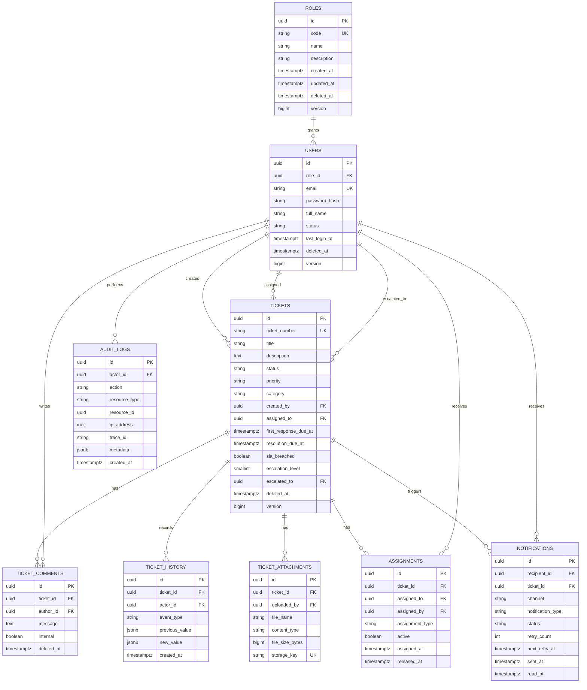

# Database Design

## Requirement Analysis

The database supports an enterprise service ticketing workflow for customers, admins, and service managers. It must handle ticket lifecycle, comments, immutable history, attachments, assignments, notifications, audit logs, SLA tracking, escalation, soft delete, UUID keys, referential integrity, and optimized portal/dashboard queries.

## Approach

- PostgreSQL UUID primary keys use `gen_random_uuid()` from `pgcrypto`.
- Foreign keys enforce ownership, assignments, authoring, and audit traceability.
- Check constraints validate roles, status values, priorities, notification states, and attachment limits.
- Mutable business tables include audit fields: `created_at`, `created_by`, `updated_at`, `updated_by`, `deleted_at`, `deleted_by`, and `version`.
- Soft delete uses `deleted_at IS NULL` partial indexes for active-record query paths.
- `ticket_history` and `audit_logs` are append-only.
- `JSONB` is limited to event snapshots and audit metadata, not core relational fields.

## ER Diagram



## Folder Structure

```text
backend/src/main/resources/db/migration/
|-- V1__create_core_schema.sql
`-- V2__seed_reference_data.sql

docs/sql/
|-- schema.sql
`-- seed-data.sql
```

## PostgreSQL Scripts

- [schema.sql](sql/schema.sql)
- [seed-data.sql](sql/seed-data.sql)

## Flyway Migration Scripts

- [V1__create_core_schema.sql](../backend/src/main/resources/db/migration/V1__create_core_schema.sql)
- [V2__seed_reference_data.sql](../backend/src/main/resources/db/migration/V2__seed_reference_data.sql)

## Validation and Constraints

- `roles.code`: `CUSTOMER`, `ADMIN`, `SERVICE_MANAGER`
- `users.status`: `ACTIVE`, `INVITED`, `LOCKED`, `DISABLED`
- `tickets.status`: `OPEN`, `ASSIGNED`, `IN_PROGRESS`, `WAITING_FOR_CUSTOMER`, `RESOLVED`, `CLOSED`, `CANCELLED`
- `tickets.priority`: `LOW`, `MEDIUM`, `HIGH`, `CRITICAL`
- `tickets.title`: 5-150 characters
- `tickets.description`: 20-5000 characters
- `assignments`: one active assignment per ticket through a partial unique index
- `ticket_attachments.file_size_bytes`: 1 byte to 25 MB
- `notifications.channel`: `IN_APP`, `EMAIL`, `SMS`

## Index Optimization Strategy

- Use partial indexes with `deleted_at IS NULL` for soft-delete-aware query paths.
- Customer ticket list: `tickets(created_by, created_at DESC)`.
- Manager queue: `tickets(assigned_to, status)`.
- Dashboard metrics: `tickets(status, created_at DESC, priority)`.
- SLA sweep: `tickets(resolution_due_at, priority)` for unresolved tickets.
- Escalation queue: `tickets(escalation_level, escalated_at DESC)` for escalated tickets.
- Active assignment enforcement: unique partial index on `assignments(ticket_id)` where `active = true`.
- Append-only reads: parent id plus descending timestamp indexes on `ticket_history`, `ticket_comments`, and `audit_logs`.
- JSONB investigation: GIN indexes on `ticket_history.new_value` and `audit_logs.metadata`.

## Query Optimization Recommendations

- Always filter mutable tables with `deleted_at IS NULL`.
- Use pagination for tickets, comments, history, notifications, and audit logs.
- Prefer keyset pagination for high-volume history and audit screens.
- Use the `ix_users_email_lower` expression index for case-insensitive email lookup.
- Keep attachment binary data outside PostgreSQL; store object keys and metadata only.
- Use optimistic locking through the `version` column for ticket updates and assignment conflict detection.
- For dashboards, aggregate by indexed columns first; introduce materialized views when metrics become expensive.
- Use `EXPLAIN (ANALYZE, BUFFERS)` before promoting dashboard, SLA sweep, and manager queue queries to production.
- Consider monthly partitioning later for `audit_logs`, `ticket_history`, and `notifications` after retention volume is known.

## Run Commands

```powershell
# Start PostgreSQL
docker compose -f docker/docker-compose.yml up -d

# Run backend tests
cd backend
mvn test
```

## Test Strategy

- Unit tests should cover domain validation around priority, status transition, SLA breach, and assignment rules.
- Integration tests should verify Flyway migration startup, foreign key integrity, one-active-assignment enforcement, soft-delete filtering, and dashboard query paths.
- Repository tests should use PostgreSQL-compatible integration testing rather than an in-memory database for schema behavior.
