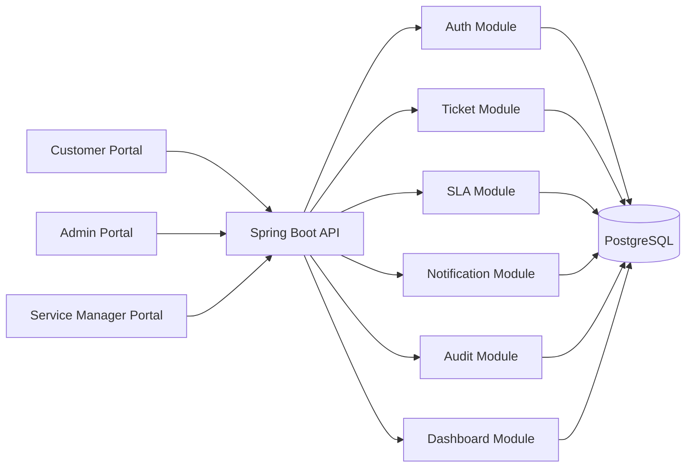
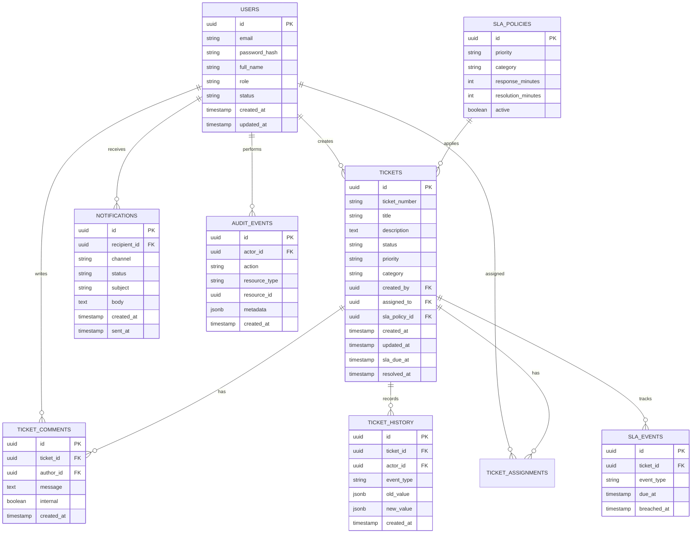
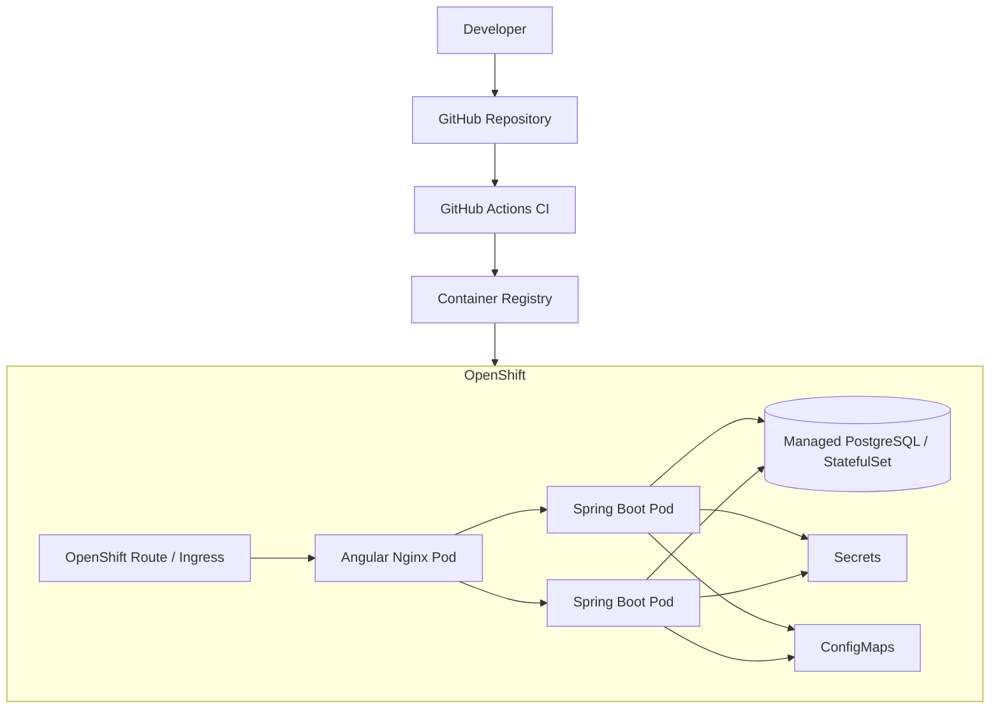
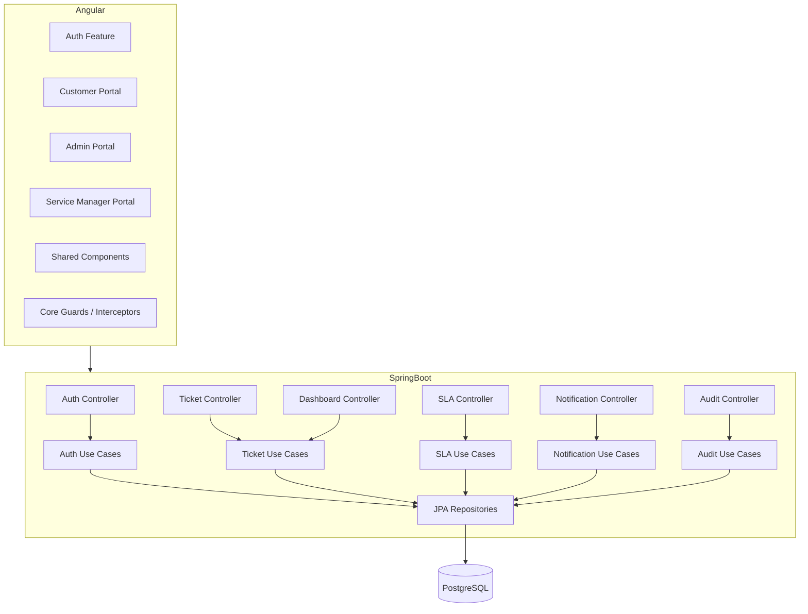
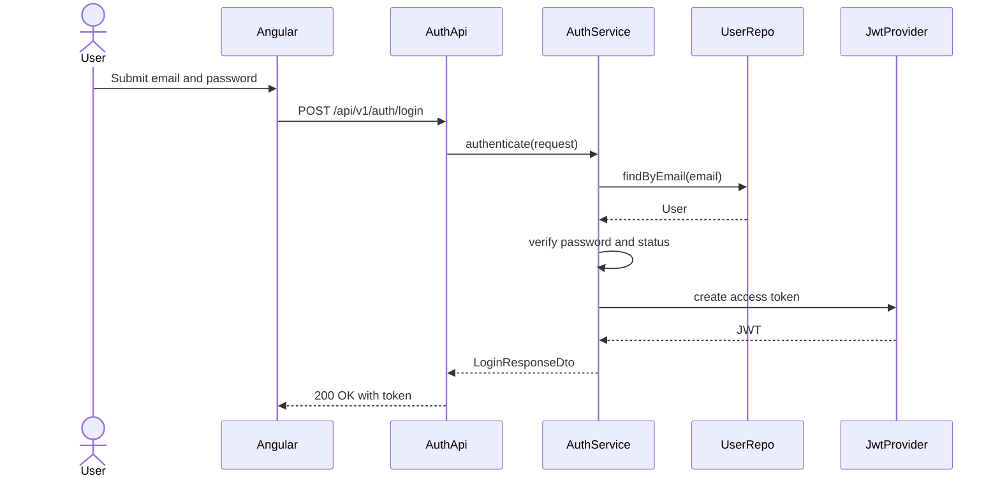
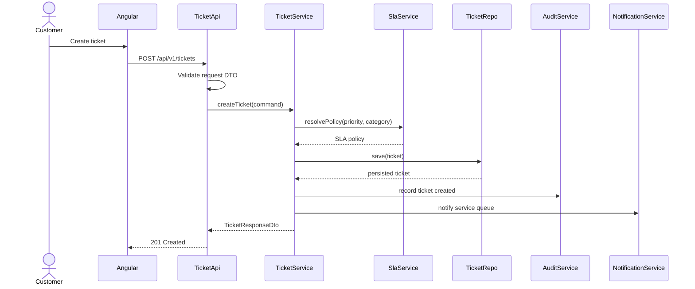
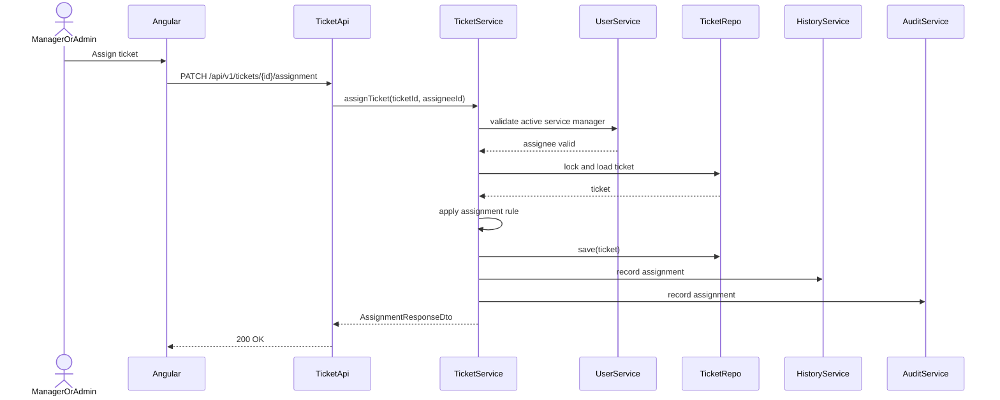
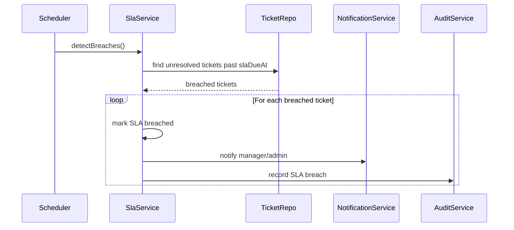

# Enterprise Service Ticketing System Design

## 1. High-Level Architecture

The Service Ticketing System is a modular monolith designed for microservice readiness. It serves three portals over a shared backend API:

- Customer Portal
- Admin Portal
- Service Manager Portal

Core capabilities:

- Authentication
- Authorization
- Ticket lifecycle
- Dashboard
- Notifications
- SLA management
- Audit logging



Architecture decisions:

- Start as a modular monolith to reduce distributed-system complexity while preserving service boundaries.
- Use DTOs at all API boundaries.
- Keep business rules in application/domain layers.
- Persist all schema changes through Flyway.
- Use stateless JWT authentication for horizontal scalability.
- Design ticket, SLA, notification, and audit modules as future extractable services.

Key risks:

- Dashboard metrics can overload transactional tables without indexing or aggregation.
- SLA breach calculation requires consistent clocks and clear timezone handling.
- Ticket assignment requires concurrency controls.
- Authorization bugs can leak customer or operational data.
- Notification delivery should not block ticket workflows.

Dependencies:

- Angular 18
- Angular Material
- Tailwind CSS
- RxJS
- Spring Boot 3
- Spring Security
- PostgreSQL
- JPA/Hibernate
- Flyway
- Docker
- OpenShift

## 2. Frontend Architecture

The frontend is an Angular 18 application organized by core infrastructure, shared UI, and feature portals.

```text
frontend/src/app/
|-- core/
|   |-- auth/
|   |-- guards/
|   |-- interceptors/
|   |-- models/
|   `-- services/
|-- shared/
|   |-- components/
|   |-- directives/
|   `-- pipes/
|-- features/
|   |-- auth/
|   |-- customer-portal/
|   |-- admin-portal/
|   |-- service-manager-portal/
|   |-- tickets/
|   |-- dashboard/
|   |-- notifications/
|   `-- sla/
`-- layout/
```

Frontend responsibilities:

- Route users into the correct portal based on role.
- Use route guards for protected pages.
- Use HTTP interceptors for JWT attachment, correlation IDs, and API error normalization.
- Keep Material UI components wrapped in shared reusable components when domain-specific behavior is needed.
- Use RxJS for state streams, request orchestration, polling, and dashboard refresh flows.

## 3. Backend Architecture

The backend is a Spring Boot 3 API using layered architecture per module.

```text
backend/src/main/java/com/ticketing/system/
|-- auth/
|   |-- controller/
|   |-- application/
|   |-- domain/
|   |-- infrastructure/
|   `-- dto/
|-- user/
|-- ticket/
|-- comment/
|-- sla/
|-- dashboard/
|-- notification/
|-- audit/
`-- common/
    |-- exception/
    |-- response/
    |-- security/
    `-- validation/
```

Layer responsibilities:

- `controller`: REST endpoints, request DTO validation, response DTO mapping.
- `application`: use cases, transactions, orchestration, authorization checks where business-specific.
- `domain`: enums, domain entities, value objects, lifecycle rules.
- `infrastructure`: JPA repositories, external adapters, persistence mappings.
- `dto`: request/response contracts only.
- `common`: centralized exceptions, security support, shared validation, API response standards.

## 4. Database Architecture

PostgreSQL is the system of record. Flyway owns schema migrations.

Main tables:

- `users`
- `roles`
- `tickets`
- `ticket_comments`
- `ticket_history`
- `ticket_assignments`
- `sla_policies`
- `sla_events`
- `notifications`
- `audit_events`



Index strategy:

- `tickets(status)`
- `tickets(created_by)`
- `tickets(assigned_to)`
- `tickets(priority, category)`
- `tickets(sla_due_at)`
- `ticket_history(ticket_id, created_at)`
- `notifications(recipient_id, status)`
- `audit_events(actor_id, created_at)`

## 5. Deployment Architecture

Docker is used for local packaging. OpenShift is the target runtime.



Deployment decisions:

- Run backend as stateless replicas.
- Store secrets in OpenShift Secrets.
- Store non-sensitive environment configuration in ConfigMaps.
- Use readiness and liveness probes.
- Use rolling deployments.
- Prefer managed PostgreSQL for production where available.

## 6. API Design Strategy

Base path: `/api/v1`

API principles:

- RESTful resources.
- DTO-only request and response bodies.
- Jakarta Bean Validation on request DTOs.
- Consistent error response format.
- Pagination for all list endpoints.
- Role authorization declared per endpoint.
- Correlation ID returned on every response.

Core contracts:

```text
POST   /api/v1/auth/login
POST   /api/v1/auth/refresh
POST   /api/v1/auth/logout

GET    /api/v1/users
GET    /api/v1/users/{userId}
POST   /api/v1/users
PATCH  /api/v1/users/{userId}/status

POST   /api/v1/tickets
GET    /api/v1/tickets
GET    /api/v1/tickets/{ticketId}
PATCH  /api/v1/tickets/{ticketId}/assignment
PATCH  /api/v1/tickets/{ticketId}/status
POST   /api/v1/tickets/{ticketId}/comments
GET    /api/v1/tickets/{ticketId}/comments
GET    /api/v1/tickets/{ticketId}/history

GET    /api/v1/dashboard/metrics

GET    /api/v1/sla/policies
POST   /api/v1/sla/policies
PATCH  /api/v1/sla/policies/{policyId}

GET    /api/v1/notifications
PATCH  /api/v1/notifications/{notificationId}/read

GET    /api/v1/audit/events
```

Validation examples:

- Ticket title: required, 5-150 characters.
- Ticket description: required, 20-5000 characters.
- Priority: required enum.
- Assignee: valid active `SERVICE_MANAGER`.
- Status transitions: must follow lifecycle rules.

## 7. Security Architecture

Security controls:

- JWT access tokens for API authentication.
- Strong password hashing.
- Role-based endpoint authorization.
- Object-level authorization for customer ticket access.
- CORS restricted to trusted frontend origins.
- HTTPS-only deployment.
- Secrets managed outside source code.
- Audit logging for sensitive operations.
- No JPA entity exposure in API responses.
- Centralized exception handling without stack trace leakage.

Role permissions:

```text
CUSTOMER
- Create tickets
- View own tickets
- Comment on own tickets
- View own ticket history

SERVICE_MANAGER
- View assigned/service-queue tickets
- Accept or service assigned tickets
- Add comments
- Resolve tickets
- View operational dashboard metrics

ADMIN
- Manage users
- Assign tickets
- Manage SLA policies
- View all tickets
- View audit logs
- View global dashboard metrics
```

## 8. Component Diagram



## 9. Sequence Diagrams

### Authentication



### Ticket Creation



### Ticket Assignment



### SLA Breach Detection



## 10. Microservice Readiness Strategy

The first implementation should remain a modular monolith. Extract services only when operational need is proven.

Extraction candidates:

- Auth Service
- Ticket Service
- SLA Service
- Notification Service
- Audit Service
- Dashboard/Reporting Service

Readiness practices:

- Keep modules loosely coupled through application services.
- Avoid direct repository access across modules.
- Use IDs instead of passing mutable domain objects across module boundaries.
- Keep module-owned database tables clearly grouped.
- Publish domain events internally for ticket-created, ticket-assigned, ticket-resolved, and SLA-breached.
- Make notification processing asynchronous-ready.

## 11. Logging Strategy

Logging standards:

- Structured JSON logs in deployed environments.
- Include `traceId`, `userId`, `role`, `requestPath`, `httpMethod`, and response status.
- Never log passwords, tokens, secrets, or full authorization headers.
- Log authentication failures without revealing whether email exists.
- Log ticket lifecycle events through audit tables, not only application logs.
- Use severity consistently: `INFO` for lifecycle, `WARN` for recoverable policy/security concerns, `ERROR` for unexpected failures.

Operational logging targets:

- Request access logs.
- Security events.
- Ticket state transitions.
- SLA breach detection.
- Notification send failures.
- Database migration startup.

## 12. Error Handling Strategy

Use centralized exception handling through `@RestControllerAdvice`.

Standard error response:

```json
{
  "timestamp": "2026-05-22T08:45:00Z",
  "status": 400,
  "error": "VALIDATION_ERROR",
  "message": "Request validation failed",
  "path": "/api/v1/tickets",
  "traceId": "01HY..."
}
```

Exception categories:

- `ValidationException`: invalid request DTO or business validation failure.
- `UnauthorizedException`: missing or invalid authentication.
- `ForbiddenException`: authenticated user lacks permission.
- `NotFoundException`: resource does not exist or should not be disclosed.
- `ConflictException`: invalid state transition, concurrent assignment, duplicate data.
- `ExternalServiceException`: notification or integration failure.
- `SystemException`: unexpected server-side failure.

HTTP mapping:

- `400 BAD_REQUEST`: validation failure.
- `401 UNAUTHORIZED`: authentication failure.
- `403 FORBIDDEN`: authorization failure.
- `404 NOT_FOUND`: missing resource.
- `409 CONFLICT`: lifecycle or concurrency conflict.
- `500 INTERNAL_SERVER_ERROR`: unexpected failure.

## 13. Test Strategy

Unit tests:

- Domain lifecycle rules.
- SLA due-date calculation.
- Authorization decision helpers.
- Application use cases.
- DTO validation.
- Exception mapping.

Integration tests:

- Auth login.
- Ticket creation.
- Ticket assignment.
- Ticket status transition.
- Ticket comments.
- Ticket history creation.
- Dashboard metrics.
- Role-based access restrictions.
- Flyway migration startup.

End-to-end tests:

- Customer creates and tracks ticket.
- Service manager assigns, services, comments, and resolves ticket.
- Admin manages users and SLA policies.
- Unauthorized users are blocked from protected portal routes.

## 14. Run Commands

```powershell
# Start PostgreSQL
docker compose -f docker/docker-compose.yml up -d

# Run backend tests
cd backend
mvn test
```

Frontend commands will be finalized after Angular workspace generation.
